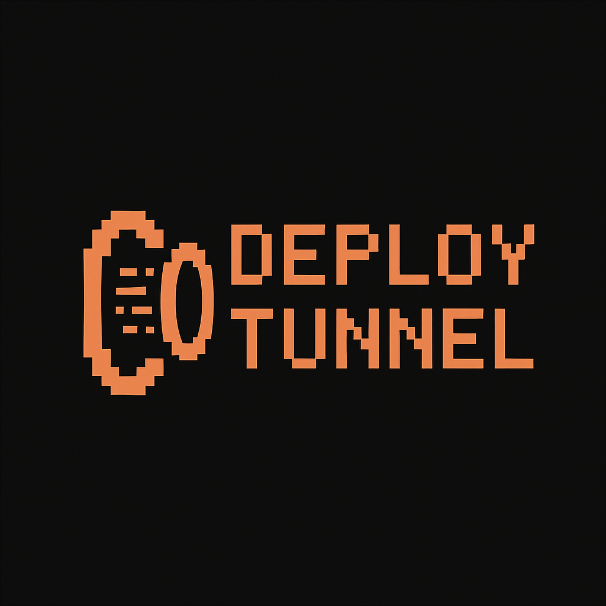

A CLI-first migration utility for safely moving deployments between providers (Vercel → Cloudflare → Render) with zero-downtime preview tunnels, environment sync, route verification, and instant rollback.

## 🧠 Core Concept

Deploy Tunnel enables **zero-downtime migrations** between hosting providers by creating temporary proxy tunnels that allow you to test and verify your migration before cutting over DNS. The tool manages authentication, environment variables, DNS records, and provides verification tools to ensure a safe migration.

## ✨ Features

- **🔐 Secure Authentication**: OS keychain integration for secure credential storage
- **🌐 Multi-Provider Support**: Vercel, Cloudflare, Render, Netlify (extensible via adapters)
- **🔄 Environment Sync**: Automatically sync environment variables between providers
- **🚇 Preview Tunnels**: Test your target deployment before DNS cutover
- **✅ Route Verification**: Compare source and target deployments route-by-route
- **📊 State Management**: SQLite-based migration tracking and history
- **🎨 Beautiful CLI**: Charm-powered TUI with progress indicators and styling
- **↩️ Instant Rollback**: One-command DNS rollback if issues arise

## 🚀 Quick Start

### Installation

```bash
# Clone repository
git clone https://github.com/johnhorton/deploy-tunnel.git
cd deploy-tunnel

# Build binary
go build -o dt ./cmd/deploy-tunnel

# Optional: Move to PATH
sudo mv dt /usr/local/bin/
```

### Basic Workflow

```bash
# 1. Initialize a new migration
dt init

# 2. Authenticate with providers
dt auth vercel
dt auth cloudflare

# 3. Fetch source configuration
dt fetch:config

# 4. Sync environment variables
dt sync env

# 5. Create preview tunnel
dt tunnel create --preview

# 6. Verify routes match
dt verify

# 7. Cut over DNS when ready
dt cutover

# 8. Rollback if needed
dt rollback
```

## 📁 Project Structure

```
deploy-tunnel/
├── cmd/
│   └── deploy-tunnel/      # Main CLI entry point
│       └── main.go
├── internal/
│   ├── cli/                # CLI commands
│   │   ├── init.go
│   │   └── auth.go
│   ├── bridge/             # Go ↔ Bun adapter bridge
│   │   ├── bridge.go
│   │   └── types.go
│   ├── tunnel/             # Tunnel engine (coming soon)
│   ├── dns/                # DNS management (coming soon)
│   ├── state/              # SQLite state management
│   │   └── state.go
│   ├── verify/             # Route verification (coming soon)
│   └── keychain/           # Secure credential storage
│       └── keychain.go
├── adapters/               # Bun + TypeScript provider adapters
│   ├── types.ts            # Bridge protocol types
│   ├── base.ts             # Base adapter class
│   ├── vercel/
│   │   └── index.ts
│   ├── cloudflare/
│   │   └── index.ts
│   └── render/
│       └── index.ts
├── ui/                     # CLI UI components
│   └── ui.go
├── bridge_spec.json        # Adapter protocol specification
├── go.mod
└── README.md
```

## 🏗️ Architecture

### Runtime Stack

| Layer | Technology | Purpose |
|-------|-----------|---------|
| CLI Core | Go 1.23+ | Core logic, tunnel engine, DNS, verification, state |
| Adapters | Bun + TypeScript | Provider SDK integration (Vercel, Cloudflare, etc) |
| State | SQLite | Persistent migrations, env maps, DNS history |
| Secrets | OS Keychain | Secure credential management |
| UI | Lipgloss | Styled CLI output and progress indicators |

### Go ↔ Bun Bridge Protocol

Adapters communicate via JSON over stdout/stderr:

**Command Structure:**
```json
{
  "verb": "fetch:config",
  "params": {
    "provider": "vercel",
    "token": "xxx",
    "project_id": "prj_xxx"
  }
}
```

**Response Structure:**
```json
{
  "ok": true,
  "data": { ... },
  "adapter_version": "1.0.0"
}
```

**Error Structure:**
```json
{
  "ok": false,
  "error": {
    "code": "AUTH_FAILED",
    "message": "Invalid token",
    "recoverable": true
  },
  "adapter_version": "1.0.0"
}
```

### Supported Bridge Commands

| Command | Description |
|---------|-------------|
| `capabilities` | List adapter capabilities |
| `auth:start` | Initiate OAuth or token flow |
| `auth:refresh` | Refresh expired token |
| `fetch:config` | Retrieve project configuration |
| `sync:env` | Push environment variables |
| `deploy:preview` | Create preview deployment |
| `dns:update` | Update DNS record |
| `dns:rollback` | Restore previous DNS record |

## 🔌 Adapter Development

### Creating a New Adapter

```typescript
// adapters/my-provider/index.ts
import { BaseAdapter } from '../base';
import type { BridgeResponse, CapabilitiesData } from '../types';

class MyProviderAdapter extends BaseAdapter {
  async capabilities(): Promise<BridgeResponse<CapabilitiesData>> {
    return this.success({
      adapter_name: 'my-provider',
      adapter_version: '1.0.0',
      supported_verbs: ['auth:start', 'fetch:config'],
      auth_type: 'token',
      features: {
        dns_management: true,
        preview_deployments: true,
        env_variables: true,
        build_logs: false,
      },
    });
  }

  async authStart(params: AuthStartParams) {
    // Implement authentication
  }

  async fetchConfig(params: FetchConfigParams) {
    // Implement config fetching
  }
}

const adapter = new MyProviderAdapter();
await adapter.execute(process.argv[2]);
```

### Testing an Adapter

```bash
# Test capabilities
echo '{}' | bun run adapters/vercel/index.ts capabilities

# Test auth
echo '{"provider":"vercel"}' | bun run adapters/vercel/index.ts auth:start

# Test config fetch
echo '{"provider":"vercel","token":"xxx","project_id":"prj_xxx"}' | \
  bun run adapters/vercel/index.ts fetch:config
```

## 📊 State Database Schema

```sql
-- Migrations table
CREATE TABLE migrations (
  id TEXT PRIMARY KEY,
  source TEXT NOT NULL,
  target TEXT NOT NULL,
  domain TEXT NOT NULL,
  status TEXT NOT NULL,
  created_at TIMESTAMP DEFAULT CURRENT_TIMESTAMP,
  updated_at TIMESTAMP DEFAULT CURRENT_TIMESTAMP
);

-- Environment variables
CREATE TABLE env_vars (
  id INTEGER PRIMARY KEY AUTOINCREMENT,
  migration_id TEXT NOT NULL,
  key TEXT NOT NULL,
  value TEXT NOT NULL,
  target_key TEXT,
  FOREIGN KEY (migration_id) REFERENCES migrations(id)
);

-- DNS records
CREATE TABLE dns_records (
  id TEXT PRIMARY KEY,
  migration_id TEXT,
  domain TEXT NOT NULL,
  record_type TEXT NOT NULL,
  record_name TEXT NOT NULL,
  record_value TEXT NOT NULL,
  ttl INTEGER DEFAULT 300,
  rollback_id TEXT,
  created_at TIMESTAMP DEFAULT CURRENT_TIMESTAMP,
  FOREIGN KEY (migration_id) REFERENCES migrations(id)
);

-- Logs
CREATE TABLE logs (
  id INTEGER PRIMARY KEY AUTOINCREMENT,
  migration_id TEXT,
  level TEXT NOT NULL,
  message TEXT NOT NULL,
  metadata TEXT,
  ts TIMESTAMP DEFAULT CURRENT_TIMESTAMP,
  FOREIGN KEY (migration_id) REFERENCES migrations(id)
);
```

Location: `~/.deploy-tunnel/state.db`

## 🎨 UI Design

### Color Palette

- **Coral** (`#ef9f76`): Primary accent, headers, keys
- **Gray** (`#6c6f85`): Secondary text
- **Light Gray** (`#a5adce`): Info text
- **Green** (`#a6d189`): Success messages
- **Red** (`#e78284`): Error messages
- **Yellow** (`#e5c890`): Warning messages

### Typography

- **Font**: JetBrains Mono (monospace)
- **Header**: Bold, coral
- **Body**: Regular, light gray

## 🔐 Security

### Credential Storage

Deploy Tunnel uses the system keychain for secure credential storage:

- **macOS**: Keychain Access
- **Linux**: Secret Service / libsecret
- **Windows**: Credential Manager

Credentials are stored under the service name `deploy-tunnel` with keys formatted as `{provider}-token`.

### Token Handling

- Tokens are never logged or written to disk
- Bridge communication happens via subprocess stdin/stdout only
- SQLite database does not store credentials
- All credential operations use the OS keychain API

## 🛣️ Roadmap

### ✅ Phase 1: Foundation (Current)

- [x] Go CLI framework
- [x] Bun adapter bridge
- [x] SQLite state management
- [x] OS keychain integration
- [x] Basic auth flow
- [x] Vercel adapter skeleton
- [x] Init command
- [x] Auth command

### 🚧 Phase 2: Core Features (Next)

- [ ] Tunnel engine (local proxy)
- [ ] DNS management
- [ ] Environment sync
- [ ] Route verification
- [ ] Cutover command
- [ ] Rollback command
- [ ] Cloudflare adapter
- [ ] Render adapter

### 🔮 Phase 3: Advanced Features

- [ ] Cloudflare Worker tunnel mode
- [ ] Background monitoring agent
- [ ] Web UI (Bun + React)
- [ ] Plugin registry
- [ ] Team authentication
- [ ] Audit logging
- [ ] Slack/Discord notifications

## 📝 Command Reference

### `dt init`

Initialize a new migration. Prompts for source provider, target provider, and domain name.

**Example:**
```bash
$ dt init
? Source provider (where you're migrating FROM)
  1) vercel
  2) cloudflare
  3) render
  4) netlify
Enter number: 1

? Target provider (where you're migrating TO)
[...]

? Domain name to migrate: myapp.com

✓ Migration initialized
Migration ID: 550e8400-e29b-41d4-a716-446655440000
Source: vercel
Target: cloudflare
Domain: myapp.com
```

### `dt auth <provider>`

Authenticate with a provider. Opens browser for OAuth flows or prompts for token.

**Example:**
```bash
$ dt auth vercel
ℹ Checking vercel adapter capabilities...
✓ Adapter: vercel v1.0.0
Auth Type: token

ℹ Starting authentication...
ℹ This provider requires a personal access token
? Enter your token: [paste token]

ℹ Storing credentials securely...
ℹ Verifying credentials...
✓ Authentication successful!
```

### `dt auth list`

List all authenticated providers.

**Example:**
```bash
$ dt auth list
ℹ Stored credentials:

✓ vercel
✓ cloudflare
```

### `dt auth revoke <provider>`

Remove stored credentials for a provider.

**Example:**
```bash
$ dt auth revoke vercel
✓ Credentials for vercel have been removed
```

## 🤝 Contributing

Contributions are welcome! This is currently an early-stage project.

### Development Setup

```bash
# Clone repository
git clone https://github.com/johnhorton/deploy-tunnel.git
cd deploy-tunnel

# Install Go dependencies
go mod download

# Install Bun dependencies
cd adapters && bun install

# Build and test
go build -o dt ./cmd/deploy-tunnel
./dt help
```

### Creating a New Provider Adapter

1. Copy an existing adapter as a template (e.g., `adapters/vercel/`)
2. Implement the `Adapter` interface from `adapters/types.ts`
3. Add provider to the CLI provider list
4. Test with the bridge protocol
5. Submit a PR!

## 📄 License

MIT License - see LICENSE file for details

## 🙏 Acknowledgments

- [Charm](https://charm.sh/) - Beautiful CLI tools and libraries
- [Bun](https://bun.sh/) - Fast JavaScript runtime
- [Go](https://go.dev/) - Systems programming language

## 📞 Support

- Issues: [GitHub Issues](https://github.com/johnhorton/deploy-tunnel/issues)
- Discussions: [GitHub Discussions](https://github.com/johnhorton/deploy-tunnel/discussions)

---

Built with ☕ and 🎨 by [@johnhorton](https://github.com/johnhorton)
